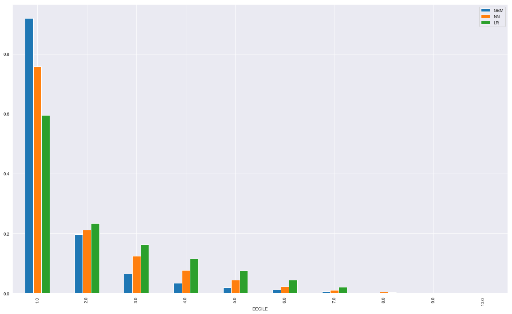
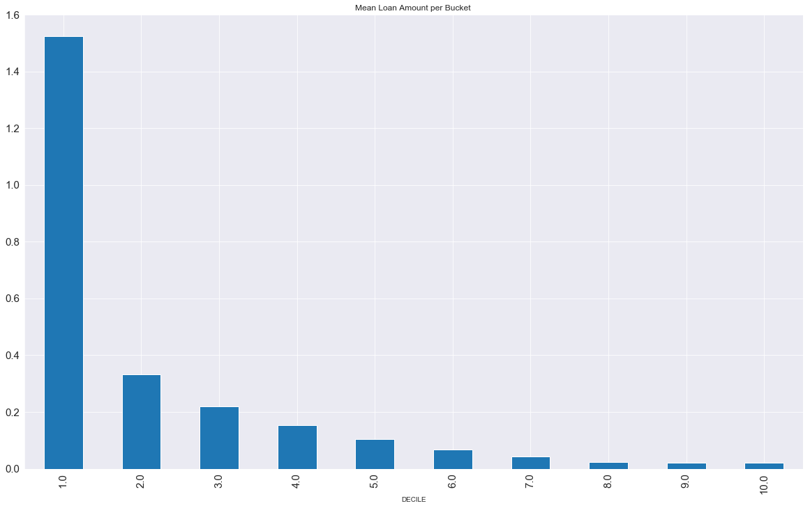
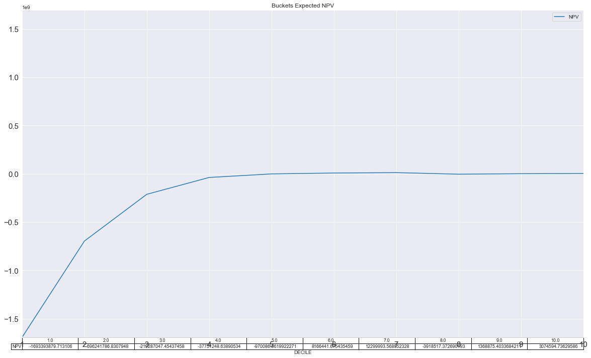

# Financial Applications of Machine Learning
My machine learning industry projects throughout the course in my Financial Engineering Program

- Built Gradient Boosting, Neural Network and Logistic Regression models after processing data and feature selection.
- Interpreted models to eliminate black box bias
- Ran grid search to fine tune the model's parameters and analyzed models stability (variance and bias).
- Sorted customers based on the probability of default estimated by each model, and segmented customers in to 10 bad rate buckets.
- Priced each buckets relevant interest rate and expected Net Present Value per segment.

## Models Evalustion for Ordinal Bad Rates Score Ranking:

## Logistic Regression Models Interest Pricing per Bucket:

## Projected Revenue (Business) Model for Booking all Segments:

# Build Lookalike Logistic Regression Model (Keras and SKLearn

While coding the neuaral netwrok model for loan prediction for later use to segment customer in to bad rate buckets,
I thought of how a preceptron with sigmoid activation function and SKLearn's Logistic regression model can give
same/approximately lookalike performance by understanding common hyperparameters.

[For full metholodgy and brain storming discussion article!](https://medium.com/analytics-vidhya/build-lookalike-logistic-regression-model-with-sklearn-and-keras-2b03c540cdd5?source=friends_link&sk=3b0c501342c93d02481fa0162eec265e "Press for the Medium Featured Article")
